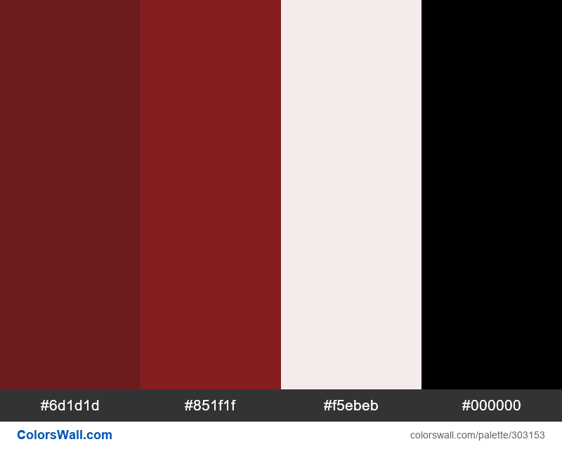
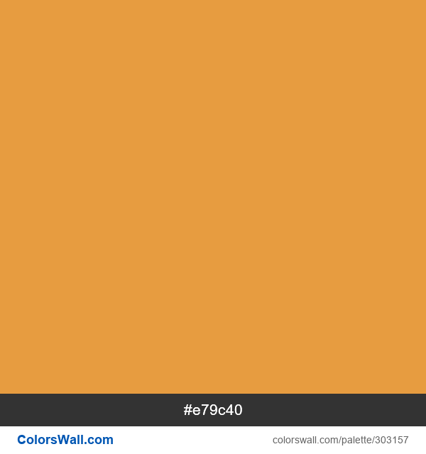
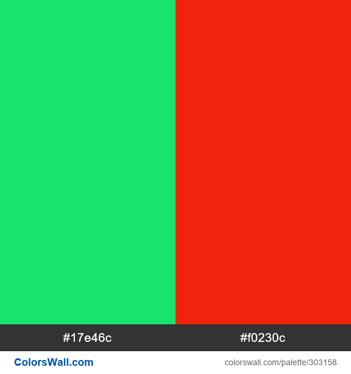
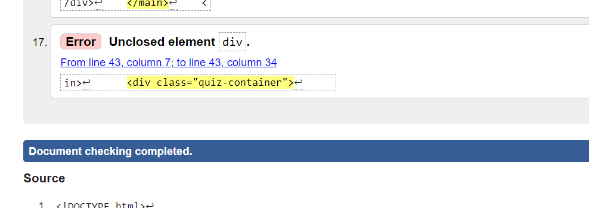
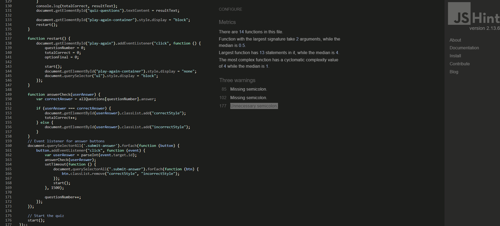

# GAME OF THRONES QUIZ

[Live Site](https://cristina-becheru.github.io/GOT-Quiz/)

## TABLE OF CONTENT

- [Project Overview](#project-overview)
- [User Experience (UX)](#user-experience-ux)
  - [Client Goals](#client-goals)
  - [Design](#design)
    - [Colours Used](#colours-used)
    - [Typography](#typography)
    - [Imagery](#imagery)
- [Actual Features](#actual-features)
- [Upcoming Features](#upcoming-features)
- [Technologies Used](#technologies-used)
  - [Languages, Frameworks, Libraries \& Programs Used](#languages-frameworks-libraries--programs-used)
  - [Testing and Accesibility](#testing-and-accesibility)
    - [W3C Markup Validation Result](#w3c-markup-validation-result)
    - [W3C CSS Validation Result](#w3c-css-validation-result)
    - [JSHint](#jshint)
    - [Lighthouse](#lighthouse-report)
    - [Manual testing](#manual-testing)
- [Deployment](#deployment)
  - [Forking a Repository](#forking-a-repository)
  - [Cloning a Repository](#cloning-a-repository)
- [Credits](#credits)
  - [Code](#code)
- [Acknowledgments](#acknowledgments)

## Project Overview

 Game of Thrones Quiz is an engaging web application designed to test users' knowledge of the popular fantasy series. The project aims to provide an interactive and entertaining experience for fans of the Game of Thrones universe.

## User Experience (UX)

By combining intriguing questions and interactive features, the Game of Thrones quiz aims to deliver an entertaining and immersive experience for fans of the series.

#### Client Goals

- Immerse users in an interactive and captivating quiz experience that keeps them hooked from start to finish
- Clear instructions on how to play the quiz are provided, ensuring that users understand the mechanics and what to expect
- Allow users to view their ultimate score upon completing the quiz
- Offer users the opportunity to retry the movie quiz after receiving their final score
  
- Deliver a seamless and user-friendly quiz interface that aligns with the Game of Thrones theme
  
## Design

### Colours used

- The chosen colors were picked to match with the background pictures ensuring an visually attractive design.

- The color scheme for the headings included RGB values such as rgb(109, 29, 29), rgb(133, 31, 31),rgb(245, 235, 235) and RGB(0, 0, 0).
  
  

- The buttons were styled using the color #e79c40f1.
  
  

- To highlight correct answers, I applied the color #17e46c, and for incorrect answers, I used #f0230c.

- The remaining colors used were white and grey (for container) to maintain a clean and straightforward aesthetic in alignment with the background pictures.

### Typography

Chosen google fonts includ three font families: Bree Serif, Libre Baskerville, and Reenie Beanie.
These fonts offer a combination of modern, classic, and playful styles, providing versatility for different design elements within the quiz.

### Imagery

  The images serves as a visual representation or promotional material related to the show, creating a connection with the audience through familiar phrases and themes from the series.
  Website contain an image for each page of the quiz.

- Landing page

  

- Quiz page

  

- Instructions page

  

- Favicon
  

## Actual Features

- The landing page features two distinct buttons—one to commence the quiz and another to access instructions on how to play.
- The instructions page provides a comprehensive guide on how to engage with the quiz. It outlines the rules, provides details on answering questions, and ensures that users have a clear understanding of the quiz mechanics before they start playing.
- The quiz presents a series of questions with multiple-choice answers.Immediate visual feedback is given for each answer chosen, with correct answers turning green and incorrect answers turning red.
- A scoring system is in place to let users know their performance relative to the total number of questions.
- The quiz ensure a responsive design that caters to users accessing the quiz from various devices, enhancing accessibility and user satisfaction.

## Upcoming Features

- Add a text input field for users to input their name.

- Extended Quiz Categories:The user would be able to pick from a range of categories.
- Multiplayer Mode:Player will engage in competition against other players, determining the ultimate champion with the most profound knowledge of the series.

## Technologies Used

### Languages, Frameworks, Libraries & Programs Used

- HTML5: to create the structure and content of the quiz.
- CSS contributes to the overall look and feel of the quiz, making it visually engaging for users.
- JavaScript was used to add interactivity to the quiz.
  - [Github](https://github.com/) | Utilized as a repository for storing the project.
  - [Font Awesome](https://fontawesome.com/icons) | Used for the inclusion of social network icons within the project.
  - [Codeanywhere](https://app.codeanywhere.com/) | Employed for coding tasks, editing, and running code directly within the web browser.
  - [Google Fonts](https://fonts.google.com/) |  Utilized to import the fonts featured on the website.
  - [Am I Responsive?](https://ui.dev/amiresponsive?) | Used to present the website's responsiveness across various devices.
  - [JSHint](https://jshint.com/) | Used to detect errors and potential issues in my JavaScript code.
  - [W3C CSS Validator](https://jigsaw.w3.org/css-validator/) | used to check the validity of my CSS code.
  - [W3C Markup Validator](https://validator.w3.org/) | used to check  my HTML code.
  - [Font Awesome](https://fontawesome.com/icons) | used to integrate my social networks icons in the quiz.
  
  - [ColorsWall](https://colorswall.com/) | Used to create a color pallete to match the background pictures

## Testing and Accesibility
  
The quiz was tested on different web browsers such as [Google Chrome](https://www.google.com/chrome/),[Microsoft edge](https://www.microsoft.com/en-us/edge?form=MA13L0), and [Safari](https://www.apple.com/safari/) to ensure it works consistently across platforms.

#### W3C Markup Validation Result

The W3C Markup Validation Result was used to verify the conformity and correctness of HTML code. On the initial examination of the 'how to play' page I have found a minor errors, which I addressed by adding a closing div.The rest of the pages were checked and no errors were found.

#### W3C CSS Validation Result

- The CSS validation process confirmed that the stylesheet contains no errors.

#### JSHint

- JSHint helped to find the errors in my script file.Minor errors were found such as 'Missing semicolon' and 'Unnecessary semicolon' and were fixed by adding or removing the semicolons.

## LightHouse report

### Landing page score

### 'How to play' page score

### Quiz page score

### Manual testing

- The quiz was tested on different devices to verify its responsiveness.
- The user interface elements, such as buttons, question displays, and answer options, were tested to ensure they function as expected.
- The correctness of the answer evaluation mechanism was verified by selecting correct and incorrect answers to questions.
- The functionality of restarting the quiz after completion was tested to ensure that it effectively resets the quiz state, allowing users to play again.
- The quiz aimed for simplicity, with the navigation bar replaced by a straightforward click on the main title, allowing users to return to the landing page.
- Social media links demonstrate responsiveness and operate as intended.

### Deployment

GitHub Pages:

1.Choose the project repository you wish to deploy in your repository section.

2.Scroll down to the "GitHub Pages" section in the Settings and select the branch you want to use for deployment.

3.Save the changes, and GitHub Pages will automatically build and deploy your project.

4.Once the deployment is complete, you'll see a link to your deployed site in the "GitHub Pages" section.

#### Forking a Repository

1.Log in to GitHub and locate the repository that you want to fork.

2.Click on the 'Fork' button found on the top right of the repository page.

3.Select the destination where you want to fork the repository.

4.After forking is complete, you'll be redirected to your forked repository.

#### Cloning a Repository

1.On the GitHub repository page, click on the "Code" button and copy the repository URL provided.

2.Open your terminal and navigate to the directory where you want to clone the repository.

3.Use the 'git clone' command followed by the repository URL you copied and press 'Enter'

## Credits

### Code

- [W3Schools](https://www.w3schools.com/) -Was a valuable resource in understanding JavaScript
  
- Youtube tutorials were also used.These tutorials were instrumental in helping me understand how to effectively use JavaScript in the development of the quiz.

  - [Web Dev Simplified](https://www.youtube.com/watch?v=riDzcEQbX6k&t=1450s&ab_channel=WebDevSimplified)
  
  - [Kevin Briggs](https://www.youtube.com/watch?v=C7NsIRhoWuE)

  - [James Q Quick](https://www.youtube.com/watch?v=u98ROZjBWy8&list=PLDlWc9AfQBfZIkdVaOQXi1tizJeNJipEx&ab_channel=JamesQQuick)

- The quiz questions were sourced from a trivia database.
  
  - [Trivia](https://www.usefultrivia.com/tv_trivia/game_of_thrones_trivia_ii.html)

- Images used in the quiz were downloaded from [Alpha Coders](https://alphacoders.com/game-of-thrones-wallpapers) and re-sized with [Imagelr](https://imagelr.com/).

- The footer code was adjusted based on the information from  [W3schools](https://www.w3schools.com/tags/tag_footer.asp).

- The concept of the multi-page quiz was inspired by [Luis Vegas](https://luisvegas88.github.io/QuizJavaScript/start.html)

### Acknowledgments

- A heartfelt thank you to my mentor,Harry Dhillon whose guidance and support have been invaluable throughout this project.
