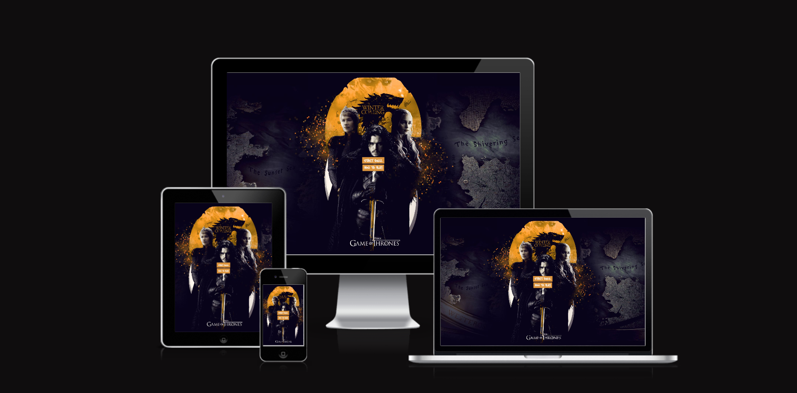
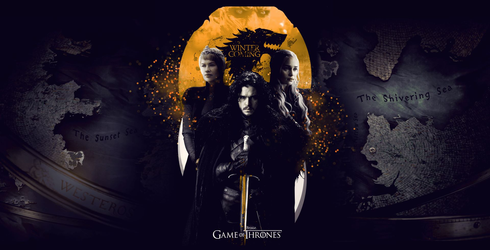
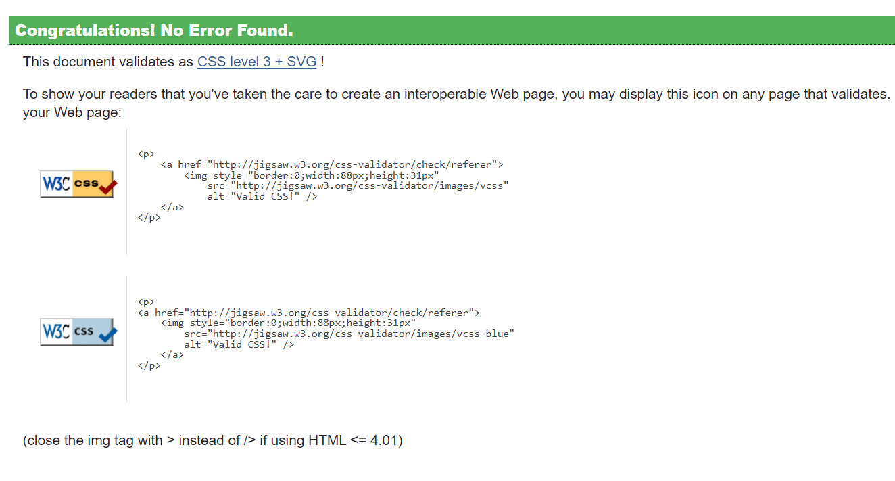
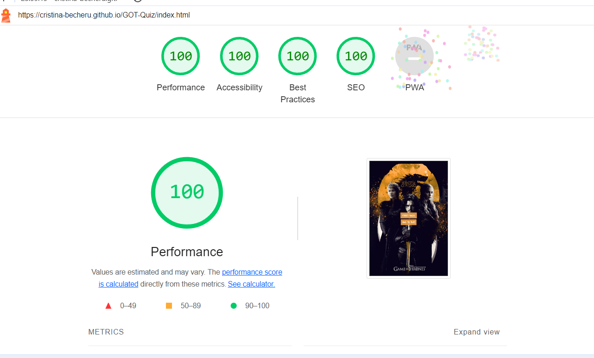
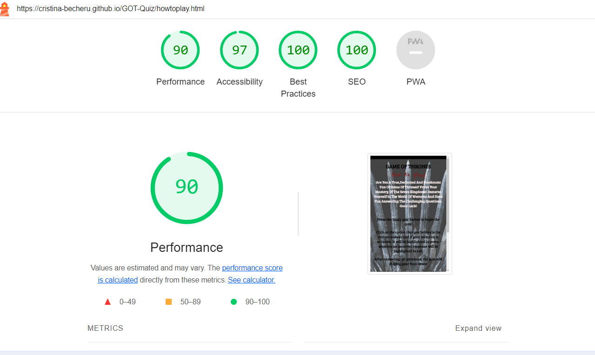

# GAME OF THRONES QUIZ

[Live Site](https://cristina-becheru.github.io/GOT-Quiz/)

## TABLE OF CONTENT

- [Project Overview](#project-overview)
- [User Experience (UX)](#user-experience-ux)
  - [Client Goals](#client-goals)
  - [Typography](#typography)
  - [Imagery](#imagery)
- [Actual Features](#actual-features)
- [Upcoming Features](#upcoming-features)
- [Technologies Used](#technologies-used)
  - [Languages, Frameworks, Libraries \& Programs Used](#languages-frameworks-libraries--programs-used)
  - [Testing and Accesibility](#testing-and-accesibility)
    - [W3C Markup Validation Result](#w3c-markup-validation-result)

## Project Overview

 Game of Thrones Quiz is an engaging web application designed to test users' knowledge of the popular fantasy series. The project aims to provide an interactive and entertaining experience for fans of the Game of Thrones universe.

## User Experience (UX)

By combining intriguing questions and interactive features, the Game of Thrones quiz aims to deliver an entertaining and immersive experience for fans of the series.

#### Client Goals

- Immerse users in an interactive and captivating quiz experience that keeps them hooked from start to finish
- Clear instructions on how to play the quiz are provided, ensuring that users understand the mechanics and what to expect
- Allow users to view their ultimate score upon completing the quiz
- Offer users the opportunity to retry the movie quiz after receiving their final score
  
- Deliver a seamless and user-friendly quiz interface that aligns with the Game of Thrones theme

### Typography

Chosen google fonts includ three font families: Bree Serif, Libre Baskerville, and Reenie Beanie.
These fonts offer a combination of modern, classic, and playful styles, providing versatility for different design elements within the quiz.

### Imagery

  The images serves as a visual representation or promotional material related to the show, creating a connection with the audience through familiar phrases and themes from the series.
  Website contain an image for each page of the quiz.

- Landing page
  

- Quiz page
  

- Instructions page
  

- Favicon
  

## Actual Features

- The homepage features two distinct buttons—one to commence the quiz and another to access instructions on how to play.
- The instructions page provides a comprehensive guide on how to engage with the quiz. It outlines the rules, provides details on answering questions, and ensures that users have a clear understanding of the quiz mechanics before they start playing.
- The quiz presents a series of questions with multiple-choice answers.Immediate visual feedback is given for each answer chosen, with correct answers turning green and incorrect answers turning red.
- A scoring system is in place to let users know their performance relative to the total number of questions.
- The quiz ensure a responsive design that caters to users accessing the quiz from various devices, enhancing accessibility and user satisfaction.

## Upcoming Features

- Add a text input field for users to input their name.

- Extended Quiz Categories:The user would be able to pick from a range of categories.
- Multiplayer Mode:Player will engage in competition against other players, determining the ultimate champion with the most profound knowledge of the series.

## Technologies Used

### Languages, Frameworks, Libraries & Programs Used

- HTML5: to create the structure and content of the quiz.
- CSS contributes to the overall look and feel of the quiz, making it visually engaging for users.
- JavaScript was used to add interactivity to the quiz.
  - [Github](https://github.com/) | Utilized as a repository for storing the project.
  - [Font Awesome](https://fontawesome.com/icons) | Used for the inclusion of social network icons within the project.
  - [Codeanywhere](https://app.codeanywhere.com/) | Employed for coding tasks, editing, and running code directly within the web browser.
  - [Google Fonts](https://fonts.google.com/) |  Utilized to import the fonts featured on the website.
  - [Am I Responsive?](https://ui.dev/amiresponsive?) | Used to present the website's responsiveness across various devices.
  - [JSHint](https://jshint.com/) | Used to detect errors and potential issues in my JavaScript code.

## Testing and Accesibility
  
The quiz was tested on the browsers listed below to ensure responsiveness and error-free performance.

- [Google Chrome](https://www.google.com/chrome/)
- [Microsoft edge](https://www.microsoft.com/en-us/edge?form=MA13L0)
- [Safari](https://www.apple.com/safari/)
  
#### W3C Markup Validation Result

The W3C Markup Validation Result was used to verify the conformity and correctness of HTML code. On the initial examination of the 'how to play' page I have found a minor errors, which I addressed by adding a closing div.The rest of the pages were checked and no errors were found.

#### W3C CSS Validation Result

- The CSS validation process confirmed that the stylesheet contains no errors.

#### JSHint

## LightHouse report

### Landing page score

### 'How to play' page score

### Quiz page score

